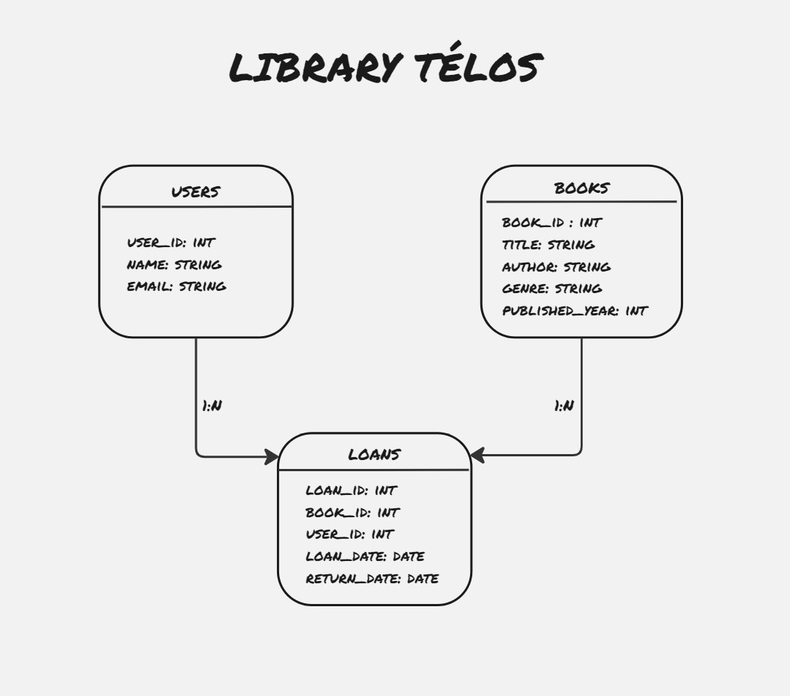

<h1 align=center>Simulator Télos nível 3 - Banco de dados 🚀</h1>

Este projeto consiste em um Sistema de Gereciamento de livros para uma biblioteca fictícia. O sistema desenvolvido possui as funcionalidades de adicionar, atualizar, excluir e buscar livros, gerenciar registros de usuários, realizar empréstimos e devoluções, e gerar relatórios utilizando joins e subqueries.

#

__Competências e conhecimentos técnicos:__

- Modelagem de dados
- Constraints
- Relacionamento de tabelas
- Queries básicas
- Joins
- Subqueries
- Functions e Procedures
- Aggregate Functions

#

__Modelagem do banco de dados:__

#

__Tecnologias utilizadas:__

#

<h4 align=center> Desenvolvido por Nayla Hilana </h4>